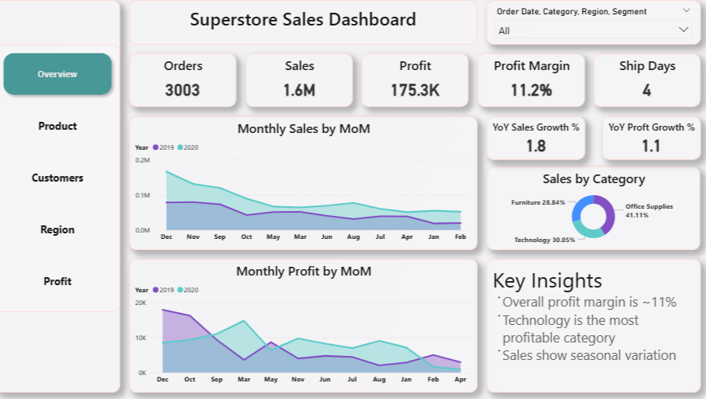

# 📊 Superstore Sales Dashboard | Power BI Project

## 📌 Project Summary
This project showcases my hands-on learning in data analytics by building an interactive **Power BI dashboard** using a Superstore sales dataset.  
The dashboard analyzes **sales performance, profit trends, customer segments, and regional insights** through clean visuals and KPIs.

This project demonstrates my ability to work with **real-world data**, clean it, analyze it, and present **meaningful business insights**.

---

## 🎯 Project Objective
- Understand business sales data  
- Track important KPIs  
- Analyze product, customer, and regional performance  
- Practice Power BI, DAX, and data visualization  
- Convert raw data into actionable insights  

---

## 🛠️ Skills & Tools Used
- Power BI Desktop  
- Power Query (Data Cleaning & Transformation)  
- Basic DAX (Measures & KPIs)  
- Data Visualization  
- Business Analysis Fundamentals  

---

## 📂 Dataset Information
- Superstore sales dataset (CSV format)  
- Contains order, sales, profit, customer, product, and regional data  
- Widely used dataset for learning business analytics  

---

## 📊 Key KPIs Created
- Total Sales  
- Total Profit  
- Total Orders  
- Profit Margin (%)  
- Average Shipping Days  

These KPIs provide a quick overview of business performance.

---

## 📈 Dashboard Overview

### 🔹 1. Sales & Profit Overview
- Monthly sales and profit trends (Year-over-Year)  
- Category-wise sales distribution  
- High-level performance indicators  

**Insight:**  
Technology category generates the highest profit.

---

### 🔹 2. Product Analysis
- Sales and profit by category and sub-category  
- Identification of loss-making products  

**Insight:**  
Some high-selling products generate low or negative profit.

---

### 🔹 3. Customer Segment Analysis
- Sales by customer segment (Consumer, Corporate, Home Office)  
- Payment mode usage  

**Insight:**  
Consumer segment contributes the highest share of sales.

---

### 🔹 4. Regional & Shipping Analysis
- Region-wise sales and profit  
- State-level sales analysis  
- Shipping mode performance  

**Insight:**  
West and East regions perform better compared to other regions.

---
## 🖼️ Dashboard Screenshots

### 🔹 Overview Page

### 🔹 Product Analysis Page

---
## 💡 Key Learnings
- Cleaned and transformed raw data using Power Query  
- Created KPIs using DAX measures  
- Designed interactive dashboards using best visualization practices  
- Used slicers and filters for dynamic analysis  
- Gained understanding of business metrics and insights  

---

## 📁 Project Structure
<pre>Superstore-Sales-PowerBI-Dashboard/
│
├── Dataset/
│ └── SuperStore_Sales_Dataset.csv
│
├── Dashboard/
│ └── Superstore_Sales_Multipage_Dashboard.pbix
│
├── Screenshots/
│ └── Dashboard_Preview.png
│
└── README.md

</pre>

---

## 🚀 How to View the Dashboard
1. Download the `.pbix` file from this repository  
2. Open it using **Power BI Desktop**  
3. Explore the dashboard using filters and slicers  

---

## 👨‍🎓 Who Is This Project For?
- Data Analyst Internships  
- Business Analyst Internships  
- Entry-Level Data Analyst / BI Roles  
- Students learning Power BI and Data Analytics  

---

## 📬 Connect With Me
- **LinkedIn:** https://www.linkedin.com/in/hussain-rashdi-171183268/  
- **GitHub:** Explore more beginner-friendly analytics projects  

⭐ *This project reflects my continuous learning journey in data analytics and business intelligence.*
